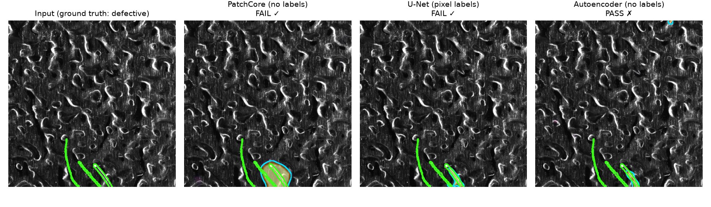

# Industrial Visual Defect Detection

**Which deep-learning approach should a factory use to catch defects when defect labels are
scarce?** This project benchmarks three answers on real industrial images (MVTec AD 2, sheet
metal): label-free anomaly detection, a reconstruction baseline, and fully supervised
segmentation. It uses a leakage-free protocol, robustness tests and a deployed inspection app.

**▶ Live demo:** *link added after deployment* · [Methodology & full results](docs/methodology.md) · [Models on Hugging Face](https://huggingface.co/yassineerraji/industrial-defect-inspection-assets)


<sub>One test part, scored by each model. Green: true defect. Cyan: region the model flags. The U-Net is scored by a cross-validation model that never saw this part.</sub>

## Results

<!-- RESULTS:START -->
| Model | Labels needed | Image AUROC | False alarms | Pixel AUROC | Dice | CPU latency |
|---|---|---:|---:|---:|---:|---:|
| Autoencoder | none | 0.43 | 33% | 0.68 | 0.06 | 0.59 s |
| PatchCore | none | 0.71 | 0% | 0.86 | 0.34 | 0.37 s |
| U-Net | pixel masks | 0.85 | 29% | 0.59 | 0.21 | 0.43 s |
<!-- RESULTS:END -->

<sub>114 test images (90 defective, 24 good). False alarms: share of good parts flagged as
defective. Latency: one 4224×1056 image on an Apple M2 CPU.</sub>

## Takeaways

- **PatchCore is the one to deploy without labels.** It needs only images of good parts, raised
  no false alarms, and localises defects best (pixel AUROC 0.86).
- **Pixel labels buy detection, not precision.** The U-Net detects the most defects (AUROC
  0.85) but flags 29% of good parts. It is worth the labelling cost only if missed defects are
  far more expensive than false alarms.
- **The classic autoencoder fails here.** On a textured surface its reconstruction error tracks
  the texture, not the defects (AUROC 0.43).

## What's inside

- **Models (PyTorch):**
  - PatchCore: ResNet-18 features and a coreset memory bank;
  - U-Net: ResNet-18 encoder, BCE + Dice loss;
  - a convolutional autoencoder.
- **Rigour:**
  - thresholds are set on validation data only;
  - U-Net cross-validation is grouped by physical part, so no test leakage;
  - robustness to lighting, noise and blur is measured.
- **MLOps:**
  - MLflow tracking and self-contained run bundles;
  - GPU training on Colab, reproduced locally to 4 decimals;
  - 80 tests.
- **Product:** a Streamlit app with side-by-side model comparison and drift monitoring. Its
  models are served from the Hugging Face Hub.

## Quickstart

```bash
pip install -e ".[dev]" && pytest                          # install + tests (no dataset needed)
streamlit run app/streamlit_app.py                         # demo app (downloads models from the Hub)
python scripts/train.py --config configs/patchcore.yaml    # train (needs MVTec AD 2 in data/)
```

Full pipeline, protocol and limitations: [docs/methodology.md](docs/methodology.md).

## Licence

Code: [MIT](LICENSE). Data and trained weights: MVTec AD 2 © MVTec Software GmbH,
CC BY-NC-SA 4.0 (non-commercial). Heckler-Kram et al., *The MVTec AD 2 Dataset*, arXiv:2503.21622, 2025.
